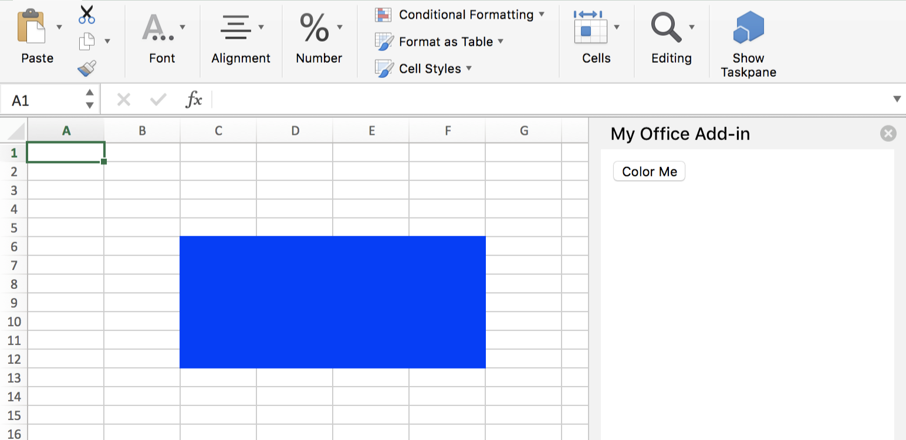

# Build an Add-in with React

An add-in includes two parts, the web app and a manifest file.

### Step 1. Generate the React project by **Create React App**

Open Visual Studio Code, Click `View` -> `Integrated Terminal`.

In your terminal, input below code and press enter to go to Desktop folder.

```bash
cd Desktop
```

Generate your React app by

```bash
create-react-app my-addin
```


### Step 2. Generate the manifest file by **[Yo Office](https://github.com/OfficeDev/generator-office)**

Go to your app folder.

```bash
cd my-addin
```

Use the following command to create the Office manifest file with [the Yeoman generator for Office Add-ins](https://github.com/OfficeDev/generator-office):

```bash
yo office
```

When prompted, supply the following information:

|Prompt|Response|
|---|---|
|New subfolder|No is default. Press enter or type 'n' to use current directory|
|Add-in name|Let's use the default name, just press enter|
|Supported Office host|Excel|
|Create new add-in|No, I only need a manifest file|


> If prompted to overwrite package.json, type 'n' to decline.

The manifest filename ends with **manifest.xml** and is located in the root directory of your project.

Open the manifest and replace all `https://localhost:3000` to `http://localhost:3000`.

### Step 3. Initialize

Open **public/index.html**, and add the following before the `</head>` tag.

```html
<script src="https://appsforoffice.microsoft.com/lib/1/hosted/office.debug.js"></script>
```

Open **src/index.js**, and replace `ReactDOM.render(<App />, document.getElementById('root'));` with the following:

```javascript
const Office = window.Office;

Office.initialize = () => {
  ReactDOM.render(<App />, document.getElementById('root'));
};
```

### Step 4. Add "Color Me" component

Open **src/App.js**. Replace contents with:

```javascript
import React, { Component } from 'react';

class App extends Component {
  constructor(props) {
    super(props);

    this.onColorMe = this.onColorMe.bind(this);
  }

  onColorMe() {
    window.Excel.run(async (context) => {
      const range = context.workbook.getSelectedRange();
      range.format.fill.color = 'blue';
      await context.sync();
    });
  }

  render() {
    return (
      <button onClick={this.onColorMe}>Color Me</button>
    );
  }
}

export default App;
```

### Step 5. Run the app

Run the dev server through the terminal.

```bash
npm start
```

### Step 6. Side load the manifest file into Office

To run the add-in, you need load the add-in into Excel. Below, we are using an open-source project currently in development, called [Office-Toolbox](https://github.com/OfficeDev/office-toolbox). It is not part of the official Office toolchain yet, but makes the sideloading process easier. Try office-toolbox below! Or you can follow our manual sideloading process documented [here](https://dev.office.com/docs/add-ins/testing/create-a-network-shared-folder-catalog-for-task-pane-and-content-add-ins).

#### Run Office-Toolbox

Open a new terminal, and run the following command. Replace 'my-addin-manifest.xml' with the name of the manifest file in your root directory (if different).

```bash
office-toolbox sideload -m my-office-add-in-manifest.xml -a excel
```

> **Did You Know:** You can also run 'office-toolbox' without passing in arguments, and you will be prompted as shown in the image below.


Your add-in should open in Excel. Click the 'Show Taskpane' button on the 'Home' tab to open your add-in.

Select the range and click **Color Me** button.



Congratulations! You just finished your first React add-in for Excel! 

